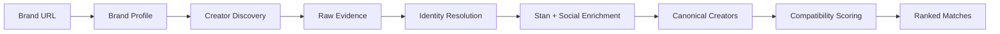
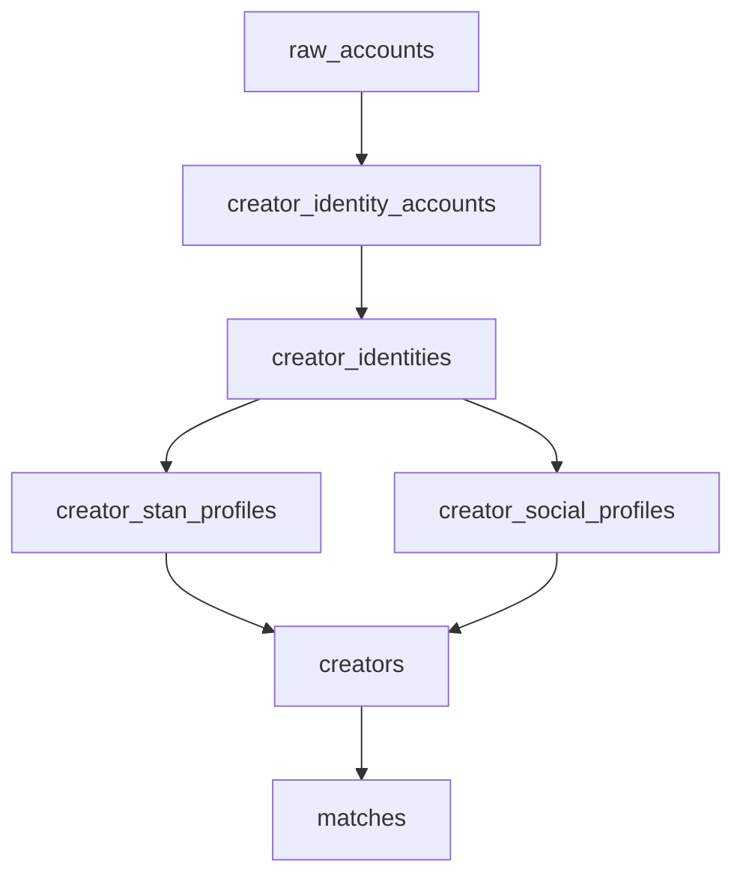

<div align="center">


# CreatorGraph

Creator discovery and brand-fit engine that turns messy public web data into explainable creator recommendations.

[Portfolio Case Study](https://shernanjavier.com/work/creatorgraph) · [Architecture](#architecture) · [Run Locally](#run-locally)

</div>

## What it does

CreatorGraph helps brands find creators who actually fit a campaign.

It analyzes a brand, discovers publicly indexed creators across the web, enriches their storefront and social signals, resolves fragmented identities, and ranks the strongest matches with explainable compatibility scores.

```text
Brand URL
   ↓
Brand profile
   ↓
Creator discovery
   ↓
Identity resolution
   ↓
Storefront + social enrichment
   ↓
Compatibility scoring
   ↓
Ranked creator matches
````

## Technical highlights

* Built a creator discovery pipeline using targeted Google/SERP queries across public web sources
* Used Playwright and Patchright to crawl JavaScript-rendered Stan.store storefronts
* Designed identity resolution to connect social accounts, Stan slugs, and personal domains into canonical creator records
* Preserved raw evidence and extraction snapshots so each stage of the ingestion pipeline remained debuggable
* Built deterministic compatibility scoring across niche, topic, platform, engagement, and audience fit
* Added explainable match reasons and module-level diagnostics instead of returning opaque recommendation scores
* Created fixture-based regression checks for matchmaking behavior

## Stack

`Next.js` · `React` · `TypeScript` · `PostgreSQL` · `Playwright` · `Patchright` · `Groq` · `SerpAPI`

## How creator discovery works

CreatorGraph does not depend on a public Stan.store creator directory.

Instead, it uses targeted search queries to locate publicly indexed profiles that reference Stan.store.

Examples:

```text
site:instagram.com "https://stan.store/"
site:tiktok.com "https://stan.store/"
site:youtube.com "stan.store/" "subscribers"
site:linkedin.com/in "stan.store/"
site:x.com "Website: stan.store/" "followers"
```

Search results are normalized into raw account records, resolved into creator identities, and then used to crawl the relevant Stan.store storefronts.

The pipeline supports multiple search paths including Google, DuckDuckGo, and SerpAPI.

## Matchmaking

CreatorGraph builds structured profiles for both sides of the marketplace.

| Brand signals       | Creator signals      |
| ------------------- | -------------------- |
| Category            | Niche                |
| Audience            | Platforms            |
| Campaign goals      | Products sold        |
| Campaign angles     | Stan.store offers    |
| Preferred platforms | Pricing              |
| Match topics        | Social links         |
|                     | Engagement estimates |

Each brand-creator pair receives a normalized score from several modules:

| Module              | Evaluates                                                  |
| ------------------- | ---------------------------------------------------------- |
| `nicheAffinity`     | Brand category vs. creator niche                           |
| `topicSimilarity`   | Campaign goals and topics vs. creator content and products |
| `platformAlignment` | Preferred platforms vs. creator presence                   |
| `engagementFit`     | Direct or derived engagement                               |
| `audienceFit`       | Brand audience vs. creator audience signals                |

The final recommendation includes score breakdowns and human-readable reasons so the ranking can be inspected rather than treated as a black box.

## Architecture



The data model keeps ingestion stages separate:



That separation makes it possible to preserve the original evidence, rerun extraction logic, improve identity resolution, and change matchmaking independently.

## Engineering decisions

### Why deterministic matching before embeddings?

The first version uses modular scoring with a shared taxonomy and alias-aware similarity layer.

That keeps rankings:

* explainable
* reproducible
* inexpensive
* easy to regression test

Embeddings could improve adjacent-topic recall later, but they were not required to validate the core matching pipeline.

### Why SERP-led discovery?

Stan.store does not expose a public creator directory suited to this workflow.

Targeted search queries provide a way to discover publicly indexed creators first, then crawl only the storefronts that have already been resolved.

### Why preserve raw evidence?

Creator data moves through several stages:

```text
search result
    ↓
raw evidence
    ↓
extraction
    ↓
identity
    ↓
enrichment
    ↓
creator
    ↓
match
```

Keeping those stages separate makes the system easier to debug and lets individual parsers or enrichment steps improve without losing the original source data.

## Project origin

I built CreatorGraph during a Stan co-working build-in-public event.

That is why the initial dataset focuses on `stan.store` creators.

The brand-facing agent is called **Stan-Lee**, a small riff on Stan's Stanley assistant concept while exploring what a creator partnership agent could look like from the brand side.

<details>
<summary><strong>Data model</strong></summary>

| Table                       | Purpose                                       |
| --------------------------- | --------------------------------------------- |
| `brands`                    | Brand profiles and campaign signals           |
| `raw_accounts`              | Search result evidence from creator discovery |
| `raw_account_extractions`   | Versioned parser snapshots                    |
| `creator_identities`        | Canonical creator identities                  |
| `creator_identity_accounts` | Social accounts connected to identities       |
| `creator_stan_profiles`     | Scraped Stan.store storefront data            |
| `creator_social_profiles`   | Estimated platform metrics                    |
| `creators`                  | Canonical creators used by matchmaking        |
| `matches`                   | Brand-to-creator match results                |

</details>

<details>
<summary><strong>Implementation details</strong></summary>

### Creator enrichment

CreatorGraph converts fragmented public evidence into canonical creator records using:

* Stan.store slugs
* personal domains
* social profile links
* cross-link evidence
* storefront metadata
* platform signals

### Semantic matching

The matching layer includes aliases for related concepts such as:

```text
skin care ↔ skincare
UGC ↔ creator content
Shopify ↔ ecommerce
```

This improves deterministic topic matching without requiring embeddings for every comparison.

### Validation

Matchmaking behavior can be checked against fixtures so changes to taxonomy, aliases, or scoring weights do not silently change expected recommendations.

</details>

<details>
<summary><strong>Run locally</strong></summary>

Prerequisites:

* Node.js
* PostgreSQL
* `pnpm`

Install and start:

```bash
pnpm install
cp example.env .env.local
pnpm dev
```

Open:

```text
http://localhost:3000
```

Useful commands:

```bash
pnpm lint
pnpm build
pnpm match:fixtures
pnpm seed
```

Environment variables:

```text
DATABASE_URL
GROQ_API_KEY
GROQ_MODEL
NEXT_PUBLIC_SITE_URL
SERP_API_KEY
SERPAPI_API_KEY
CREATOR_DISCOVERY_ENGINE
CREATOR_DISCOVERY_BROWSER
CREATOR_STAN_ENRICH_BROWSER
```

</details>

<details>
<summary><strong>Limitations</strong></summary>

* Discovery coverage depends on publicly indexed profiles
* Stan.store layout changes can require scraper updates
* Social metrics are currently evidence/prior-based estimates rather than deep platform analytics
* Semantic matching is deterministic and taxonomy-based
* A production crawler would need stronger queueing, retry policy, rate limiting, and observability

</details>

## Author

Built by [Shernan Javier](https://shernanjavier.com).
