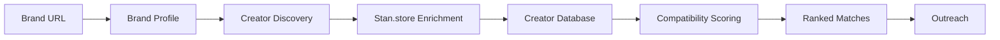
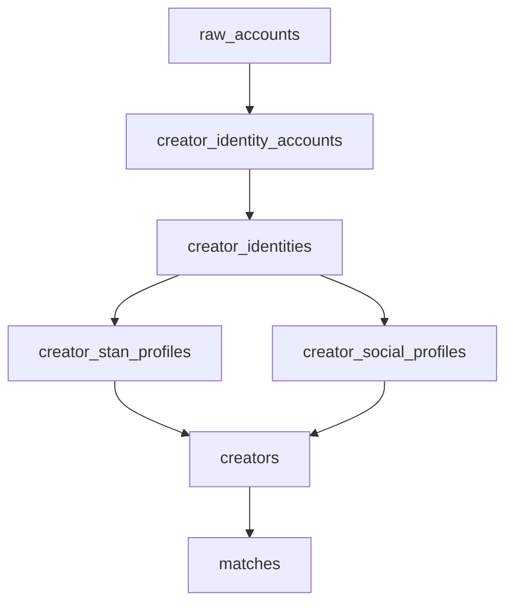

<div align="center">


# CreatorGraph

### Discover, enrich, and match Stan.store creators with brands.

CreatorGraph is a full-stack creator partnership intelligence app. It analyzes a brand, discovers real Stan.store creators through Google dork/SERP-led discovery, enriches creator storefront and social signals, then ranks the best creator matches with explainable compatibility scoring.

[Recruiter Overview](./docs/recruiter-friendly-creatorgraph-overview.md) ·
[Technical Pipeline](./docs/stan-store-creator-pipeline.md) ·
[Run Locally](#run-locally)

</div>

## Demo

> Add a short GIF here after recording the product flow.

Suggested GIF flow:

```text
Enter brand URL -> Build brand profile -> View ranked creators -> Inspect match reasons
```

Suggested full-demo thumbnail:

```md
[](VIDEO_LINK)
```

## The Problem

Finding relevant creators is fragmented and manual. Brands often need to search across social platforms, inspect storefronts one by one, estimate audience fit, and guess whether a creator is a good campaign match.

CreatorGraph turns that messy process into a structured pipeline.

## The Solution



CreatorGraph builds structured data on both sides of the marketplace:

| Side | Signals |
| --- | --- |
| Brand | Category, audience, goals, campaign angles, preferred platforms, match topics |
| Creator | Niche, platforms, products sold, Stan.store offers, pricing, social links, engagement estimates |

The output is a ranked creator shortlist with reasons, score breakdowns, and outreach context.

## Key Features

| Feature | What It Does |
| --- | --- |
| Brand analysis | Crawls and analyzes a brand website into a structured campaign profile |
| Google dork creator discovery | Uses targeted `site:` queries to find social profiles that mention Stan.store |
| Stan.store scraping | Browser-crawls `https://stan.store/{slug}` pages to extract creator offers and profile signals |
| Identity resolution | Links social accounts, Stan slugs, and domains into creator identities |
| Creator enrichment | Converts raw profile/storefront evidence into canonical creator records |
| Explainable matchmaking | Scores creators across niche, topic, platform, engagement, and audience fit |
| Outreach generation | Uses the matched creator and brand context to draft campaign outreach |

## Screenshots To Add

Add screenshots or GIFs in this order for the strongest portfolio walkthrough:

1. Brand URL intake
2. Stan-Lee brand chat or analysis screen
3. Creator explorer or creator deck
4. Match result cards
5. Compatibility breakdown
6. Outreach generation

Suggested captions:

- "Brand URL intake starts the pipeline."
- "Stan-Lee turns brand context into creator strategy."
- "Creator cards show fit score, niche, platform reach, and Stan links."
- "The scraper converts Stan storefronts into structured creator signals."
- "The matcher ranks creators with explainable reasons."

## How Creator Discovery Works

CreatorGraph does not rely on a Stan.store creator directory. It uses Google dork-style search queries to find indexed social profiles that publicly reference Stan.store.

Examples from the app:

```text
site:instagram.com "https://stan.store/"
site:tiktok.com "https://stan.store/"
site:youtube.com "stan.store/" "subscribers"
site:linkedin.com/in "stan.store/"
site:x.com "Website: stan.store/" "followers"
```

Those search results are normalized into raw account records, resolved into creator identities, and then used to crawl the actual Stan storefronts.

## Technical Highlights

- Next.js app router with React and TypeScript
- PostgreSQL data model for raw evidence, identities, enriched profiles, creators, and matches
- Playwright/Patchright browser automation for JavaScript-rendered Stan.store pages
- SERP-led creator discovery with Google, DuckDuckGo, or SerpAPI execution paths
- Deterministic identity resolution using Stan slugs, personal domains, and cross-link evidence
- Modular compatibility scoring with explainable reasons and confidence-aware weighting
- Semantic alias layer for terms like `skin care`, `skincare`, `UGC`, `creator content`, and `Shopify brand owners`
- Fixture-based regression checks for matchmaking behavior

## Architecture



Core tables:

| Table | Purpose |
| --- | --- |
| `brands` | Brand profiles and campaign signals |
| `raw_accounts` | Search result evidence from creator discovery |
| `raw_account_extractions` | Versioned parser snapshots from raw account evidence |
| `creator_identities` | Canonical creator identities |
| `creator_identity_accounts` | Social accounts linked to identities |
| `creator_stan_profiles` | Scraped Stan.store storefront data |
| `creator_social_profiles` | Estimated platform metrics |
| `creators` | Canonical creators used by matchmaking |
| `matches` | Brand-to-creator match results |

For the implementation-heavy version, see [the Stan.store creator pipeline doc](./docs/stan-store-creator-pipeline.md).

## Matchmaking Model

Each brand-creator pair receives a normalized score from deterministic modules:

| Module | Evaluates |
| --- | --- |
| `nicheAffinity` | Brand category vs creator niche |
| `topicSimilarity` | Brand goals/topics vs creator topics, products, and intent signals |
| `platformAlignment` | Preferred brand platforms vs creator platform presence/performance |
| `engagementFit` | Direct or derived creator engagement |
| `audienceFit` | Brand audience vs creator audience signals |

The result includes human-readable reasons and module-level diagnostics so the recommendation can be inspected.

## Engineering Decisions

### Why deterministic matching before embeddings?

The first version uses modular scoring plus a shared taxonomy and alias-aware similarity layer. This keeps rankings explainable, reproducible, inexpensive, and easy to test before introducing embedding infrastructure.

### Why Google dork/SERP-led discovery?

Stan.store does not provide a public creator directory suited to this workflow. The app therefore uses targeted search queries to locate publicly indexed social profiles containing Stan.store links, then crawls only the resolved storefronts.

### Why preserve raw evidence?

The data model keeps raw search rows, extraction snapshots, identity links, enriched Stan profiles, and final creator records separate. This makes the pipeline easier to debug and lets each stage improve independently.

## Tech Stack

| Area | Technology |
| --- | --- |
| Application | Next.js, React, TypeScript |
| Database | PostgreSQL |
| Browser automation | Playwright, Patchright |
| AI analysis | Groq |
| Search discovery | Google SERP, DuckDuckGo HTML search, SerpAPI |
| Validation | ESLint, Next build, matchmaking fixtures |

## Run Locally

Prerequisites:

- Node.js
- PostgreSQL
- `pnpm`

Install and start:

```bash
pnpm install
cp example.env .env.local
pnpm dev
```

Open:

```text
http://localhost:3000
```

Useful commands:

```bash
pnpm lint
pnpm build
pnpm match:fixtures
pnpm seed
```

Environment variables:

| Variable | Purpose |
| --- | --- |
| `DATABASE_URL` | PostgreSQL connection string |
| `GROQ_API_KEY` | Brand/profile AI analysis |
| `GROQ_MODEL` | Optional Groq model override |
| `NEXT_PUBLIC_SITE_URL` | App URL for server-side API calls |
| `SERP_API_KEY` / `SERPAPI_API_KEY` | Optional SerpAPI search execution |
| `CREATOR_DISCOVERY_ENGINE` | `auto`, `google`, `duckduckgo`, or `serpapi` |
| `CREATOR_DISCOVERY_BROWSER` | `playwright` or `patchright` |
| `CREATOR_STAN_ENRICH_BROWSER` | `playwright` or `patchright` |

## Limitations And Next Steps

- Search coverage depends on public indexed profiles.
- Stan.store layout changes may require scraper updates.
- Social metrics are currently evidence/prior-based estimates rather than deep platform analytics.
- Semantic matching is deterministic and taxonomy-based; embeddings could improve adjacent-topic recall.
- Production crawling would need stronger rate limits, queueing, observability, and retry policy.

## Documentation

- [Recruiter-friendly overview](./docs/recruiter-friendly-creatorgraph-overview.md)
- [Stan.store creator scraping pipeline](./docs/stan-store-creator-pipeline.md)

## Author

Built by Shernan Javier.
