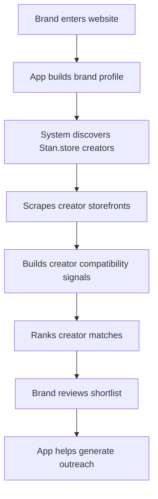
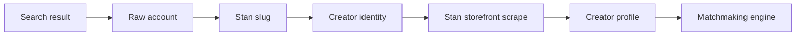
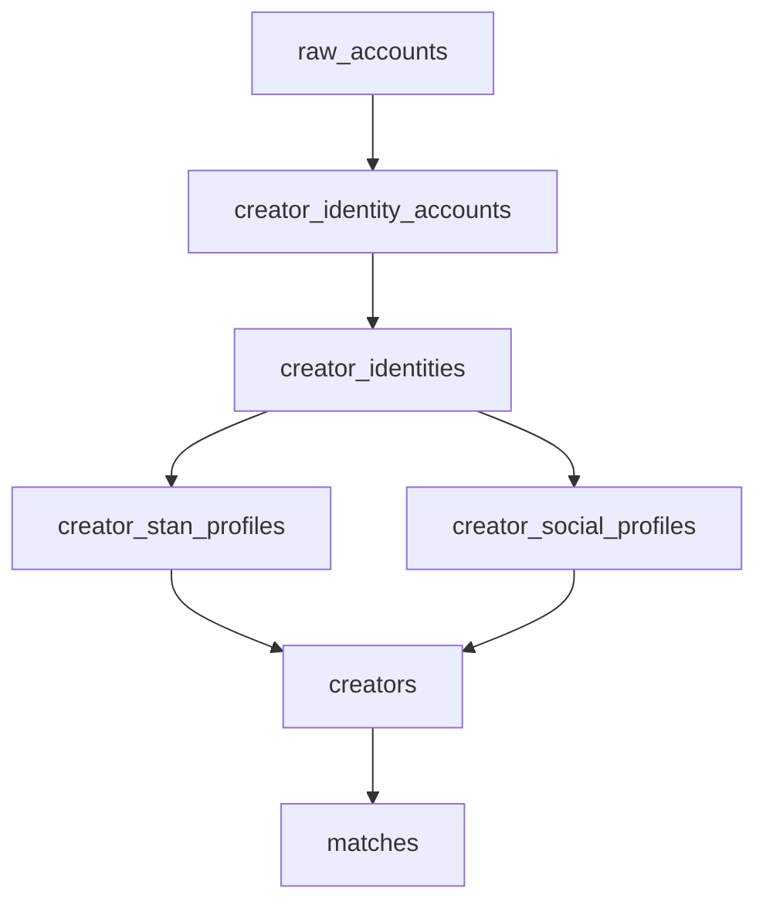

# CreatorGraph Recruiter-Friendly Overview

This is the skim-friendly version of the CreatorGraph / Stan-Lee app. It is written for recruiters, hiring managers, and portfolio reviewers who want to understand the product, the technical depth, and the user value quickly.

## One-Line Summary

CreatorGraph turns a creator platform into an automated brand-to-creator matchmaking engine: brands enter a website, the app analyzes the brand, discovers real Stan.store creators, enriches their storefront/social data, ranks the best matches, and helps generate outreach.

## What The App Does

CreatorGraph helps brands find creators who are actually relevant to their product, audience, and campaign goals.

Instead of manually browsing creators or guessing who might be a fit, the app builds structured data on both sides:

- Brand side: category, audience, goals, platforms, campaign angles, and match topics
- Creator side: niche, platforms, audience, products sold, Stan.store offers, social signals, engagement estimates, and compatibility evidence

The result is a ranked creator shortlist with explainable reasons.

> Screenshot placeholder: Add homepage or brand URL intake screenshot here.

## Product Flow



## User Journey

1. A brand enters its website.
2. The app analyzes the site and extracts brand positioning.
3. The app uses Google dork-style search queries to find social profiles connected to Stan.store.
4. It resolves social accounts into unique creator identities.
5. It visits each creator's Stan.store storefront.
6. It extracts offers, pricing, product types, profile images, socials, and creator signals.
7. It imports creators into a canonical creator database.
8. It ranks creators for the brand using a deterministic compatibility engine.
9. The brand gets a shortlist with reasons and can generate outreach.

> GIF placeholder: Add short GIF of entering a brand URL and landing on matches.

## The Core Technical Problem

Creator data is messy.

A creator may have:

- An Instagram profile
- A TikTok profile
- A YouTube channel
- A Stan.store page
- Different handles across platforms
- Partial follower data
- Product offers that only appear after JavaScript loads

The app has to turn messy public signals into clean, matchable creator records.

## How Creator Discovery Works

The app does not assume Stan.store has a public creator directory to crawl.

Instead, it uses Google dork-style queries on public search results, such as `site:instagram.com "https://stan.store/"`, to find social profiles that mention `stan.store`. It then extracts Stan storefront links from those results.

Example discovery sources:

| Platform | What The App Looks For |
| --- | --- |
| Instagram | `site:instagram.com "https://stan.store/"` |
| TikTok | `site:tiktok.com "https://stan.store/"` |
| YouTube | `site:youtube.com "stan.store/" "subscribers"` |
| LinkedIn | `site:linkedin.com/in "stan.store/"` |
| X/Twitter | `site:x.com "Website: stan.store/" "followers"` |

> Screenshot placeholder: Add discovery or explorer screenshot here.

## Creator Data Pipeline



## What Gets Scraped From Stan.store

For each resolved Stan creator, the app visits:

```text
https://stan.store/{creatorSlug}
```

It uses a browser-based scraper so it can handle JavaScript-rendered storefronts.

The scraper extracts:

| Data | Why It Matters |
| --- | --- |
| Profile name and handle | Creator identity and display |
| Bio | Creator positioning |
| Header image | Better visual creator cards |
| Offer cards | What the creator sells |
| Pricing | Buying intent and monetization signal |
| Product types | Course, coaching, template, membership, guide, service |
| Social links | Cross-platform identity and reach |
| Email / CTA style | Outreach and conversion intent |
| Page text | Additional classification evidence |

> Screenshot placeholder: Add Stan creator card or scraped profile output here.

## Identity Resolution

A key engineering challenge is deciding when multiple accounts belong to the same person.

The app resolves identities using deterministic anchors:

1. Stan.store slug
2. Personal domain
3. Explicit cross-links found in profile text
4. Same-handle candidates across platforms

This avoids merging creators too aggressively when evidence is weak.

## Matchmaking Engine

The ranking engine compares the brand profile against creator signals.

It scores across several modules:

| Module | What It Scores |
| --- | --- |
| Niche affinity | Does the creator's niche fit the brand category? |
| Topic similarity | Do creator topics/products match the brand campaign? |
| Platform alignment | Is the creator active on preferred platforms? |
| Engagement fit | Does the creator have useful engagement/reach signals? |
| Audience fit | Does the creator reach the right audience? |

The app also stores reason strings and score breakdowns so results are explainable, not a black box.

> GIF placeholder: Add GIF of ranked creator deck or match page here.

## Example Match Result

A match card can explain things like:

- Strong topic alignment
- Platform alignment
- Audience fit
- Strong engagement
- Priority fit based on brand instructions

This helps a user understand why a creator was recommended, which is important for trust.

## Why This Is Useful

For brands:

- Faster creator discovery
- Better fit than manual browsing
- Clear match reasoning
- Less cold outreach guesswork

For creator platforms:

- Turns existing creator ecosystems into partnership engines
- Creates a structured pipeline for brand deal generation
- Makes creator data more searchable, comparable, and monetizable

## Technical Highlights

- Built with Next.js, React, TypeScript, and Postgres
- Uses Playwright/Patchright browser automation for JS-rendered Stan.store pages
- Uses structured database tables for raw evidence, identities, Stan profiles, social metrics, canonical creators, and matches
- Separates synthetic demo data from real imported creators
- Uses deterministic, explainable scoring modules rather than opaque recommendations
- Includes a semantic alias layer so terms like `skin care`, `skincare`, `UGC`, `creator content`, and `Shopify brand owners` map more naturally

## Database Shape At A Glance



## Main Tables

| Table | Purpose |
| --- | --- |
| `raw_accounts` | Raw search results from social/search discovery |
| `raw_account_extractions` | Versioned parser output from raw discovery evidence |
| `creator_identities` | One logical creator identity |
| `creator_identity_accounts` | Social accounts linked to identities |
| `creator_stan_profiles` | Scraped Stan.store storefront data |
| `creator_social_profiles` | Estimated platform metrics |
| `creators` | Canonical creators used by the app |
| `matches` | Brand-to-creator ranking results |

## App Screens To Add Later

Add visuals in this order for a strong portfolio walkthrough:

1. Homepage / brand URL input
2. Brand analysis or Stan-Lee chat screen
3. Creator explorer or creator deck
4. Match result cards
5. Creator detail / outreach generation
6. Optional: database/pipeline diagram

## Suggested Screenshot/GIF Captions

Use short captions like:

- "Brand URL intake starts the pipeline."
- "Stan-Lee turns brand context into creator strategy."
- "Creator cards show fit score, niche, platform reach, and Stan links."
- "The scraper converts Stan storefronts into structured creator signals."
- "The matcher ranks creators with explainable reasons."

## Portfolio Talking Points

If asked about the project, the strongest framing is:

- I built an end-to-end data pipeline, not just a UI.
- The app handles messy real-world creator identity data.
- The scraper uses browser automation for JavaScript storefronts.
- The data model preserves raw evidence, resolved identities, enriched profiles, and final canonical creators.
- The recommendation engine is explainable and modular.
- The system is designed so better discovery, enrichment, or ML scoring can be swapped in later.

## Recruiter-Friendly Architecture Summary

CreatorGraph is a full-stack AI/data product. It combines web crawling, identity resolution, structured enrichment, database modeling, and explainable ranking into a usable brand-facing creator matchmaking workflow.

The most important technical achievement is turning unstructured public creator signals into normalized creator records that can be ranked and explained.

## Detailed Technical Reference

For the implementation-heavy version, see:

[Stan.store Creator Scraping Pipeline](./stan-store-creator-pipeline.md)
