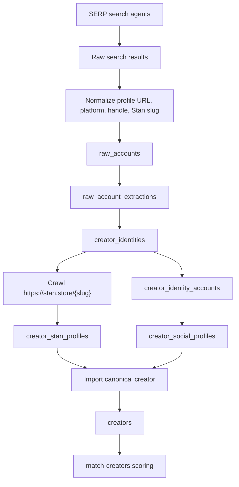
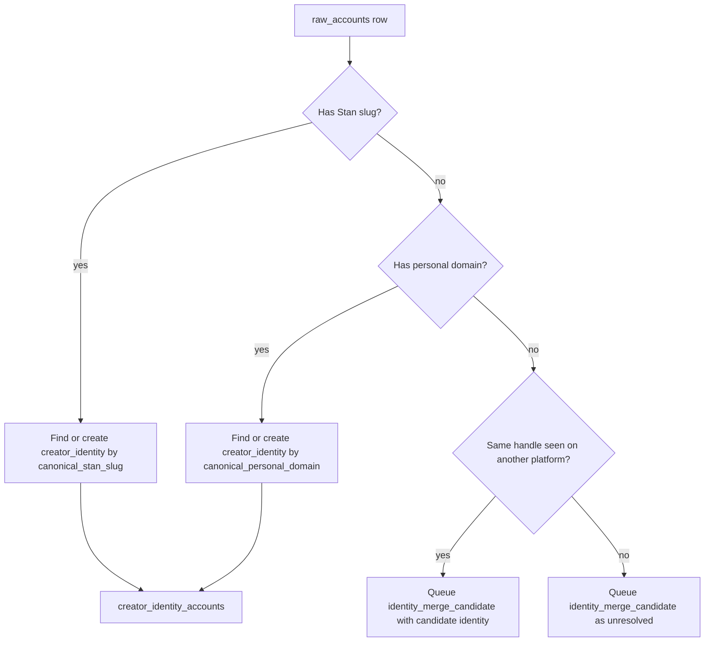
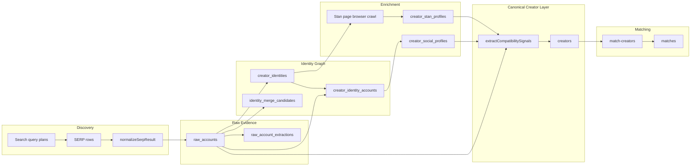

# Stan.store Creator Scraping Pipeline

This document describes how the app discovers, scrapes, enriches, imports, and ranks Stan.store creators. It is written as a diagram-ready process reference.

## Short Version

The app does not start by crawling `stan.store` directly for a directory of creators. It first uses Google dork-style SERP queries such as `site:instagram.com "https://stan.store/"` to find public social profiles that mention `stan.store`, extracts Stan slugs from those search results, resolves accounts into creator identities, then crawls each resolved `https://stan.store/{slug}` page for richer storefront data.



## Main Code Paths

| Stage | Endpoint | Main Code | Main Tables |
| --- | --- | --- | --- |
| Discover creators | `POST /api/creator-discovery/crawl` | `app/api/creator-discovery/crawl/route.ts`, `lib/creator/discovery/googleSerpAgents.ts` | `raw_accounts` |
| Normalize SERP rows | internal during crawl/ingest | `lib/creator/discovery/normalize.ts`, `lib/creator/discovery/ingestSerpResults.ts` | `raw_accounts` |
| Extract raw account signals | `POST /api/creator-discovery/extract` | `lib/creator/discovery/extractRawAccounts.ts`, `lib/creator/discovery/extractSignals.ts` | `raw_account_extractions` |
| Resolve identities | `POST /api/creator-identity/resolve` | `lib/creator/identity/resolveIdentities.ts` | `creator_identities`, `creator_identity_accounts`, `identity_merge_candidates` |
| Scrape Stan pages | `POST /api/creator-stan/enrich-agent` | `lib/creator/stan/enrichStanProfileAgent.ts` | `creator_stan_profiles` |
| Optional basic Stan scrape | `POST /api/creator-stan/enrich` | `lib/creator/stan/enrichStanProfile.ts` | `creator_stan_profiles` |
| Estimate social metrics | `POST /api/creator-social/enrich` | `lib/creator/social/enrichSocialMetrics.ts` | `creator_social_profiles`, `creators` |
| Import canonical creators | `POST /api/creator-import` | `app/api/creator-import/route.ts`, `lib/creator/import/extractCompatibilitySignals.ts` | `creators` |
| Rank creators | `POST /api/match-creators` | `app/api/match-creators/route.ts`, `lib/match/*` | `matches` |

## Stage 1: Discovery Through Search Agents

Entry point:

```http
POST /api/creator-discovery/crawl
```

The app runs platform-specific Google dork-style search agents defined in `lib/creator/discovery/googleSerpAgents.ts`.

These are "dorks" in the practical sense: each query uses a `site:` operator plus exact-match Stan.store phrases to discover creators from indexed social profiles. The same query strings can be executed through Google, DuckDuckGo, or SerpAPI depending on the configured `engine`.

Current agents:

| Agent ID | Platform | Query Intent |
| --- | --- | --- |
| `x_stan_creators` | X/Twitter | `site:x.com "Website: stan.store/" "followers"` |
| `instagram_stan_creators` | Instagram | `site:instagram.com "https://stan.store/" " followers"` |
| `linkedin_stan_creators` | LinkedIn | `site:linkedin.com/in "stan.store/"` |
| `tiktok_stan_creators` | TikTok | `site:tiktok.com "https://stan.store/"` |
| `youtube_stan_creators` | YouTube | `site:youtube.com "stan.store/" "subscribers"` |

Supported crawler options:

| Option | Purpose |
| --- | --- |
| `engine` | `auto`, `google`, `duckduckgo`, or `serpapi` |
| `browser` | `playwright` or `patchright` |
| `platforms` | Limit discovery to selected platforms |
| `agents` | Run specific agent IDs |
| `maxResultsPerPlatform` | Cap results per platform |
| `platformLimits` | Per-platform caps |
| `queryDelayMsMin`, `queryDelayMsMax` | Slow-run scheduling |
| `persist` | Save results into `raw_accounts` |
| `extractAfterPersist` | Immediately run raw account extraction |
| `discoveryRunId` | Reuse or provide a run ID |

If `engine=auto`, the app prefers SerpAPI when `SERP_API_KEY` or equivalent env vars are present.

Engine behavior:

| Engine | How the dork is executed |
| --- | --- |
| `google` | Playwright/Patchright opens `https://www.google.com/search?q=...` |
| `duckduckgo` | Playwright/Patchright opens DuckDuckGo HTML search |
| `serpapi` | Calls SerpAPI's Google Search API |
| `auto` | Uses SerpAPI when a key exists, otherwise browser SERP crawling |

Output:

- Preview results from the crawler
- Normalized preview rows
- Optional persisted `raw_accounts`
- Optional extraction summary if `extractAfterPersist=true`

## Stage 2: SERP Normalization And Raw Account Storage

Main code:

- `lib/creator/discovery/normalize.ts`
- `lib/creator/discovery/ingestSerpResults.ts`

Each search result is normalized into a creator-account candidate.

Extracted fields:

| Field | Meaning |
| --- | --- |
| `source_url` | Original SERP result URL |
| `normalized_profile_url` | Canonical platform profile URL |
| `platform` | `x`, `instagram`, `linkedin`, `tiktok`, `youtube`, or `unknown` |
| `handle` | Platform handle when parseable |
| `stan_slug` | Slug from `stan.store/{slug}` text |
| `follower_count_estimate` | Follower/subscriber count parsed from title/snippet/raw payload |
| `raw` | Original result metadata |

Persisted table:

```text
raw_accounts
```

The unique key is effectively `(discovery_run_id, query, source_url)`, so rerunning a discovery can update existing rows for the same run/query/source.

## Stage 3: Raw Account Signal Extraction

Entry point:

```http
POST /api/creator-discovery/extract
```

Main code:

- `lib/creator/discovery/extractRawAccounts.ts`
- `lib/creator/discovery/extractSignals.ts`

This stage rereads `raw_accounts` and extracts a richer, versioned snapshot of evidence. It can run as a dry run or persist rows.

Inputs:

- `discoveryRunId`
- `platform`
- `rawAccountIds`
- `extractorVersion`
- `limit`
- `previewLimit`
- `dryRun`
- `samples` for parser testing without database writes

Extracted fields:

| Field | Meaning |
| --- | --- |
| `stan_url` | First detected Stan URL |
| `stan_slug` | First detected Stan slug |
| `all_stan_urls` | Up to 10 detected Stan URLs |
| `follower_count_estimate` | Best follower/subscriber estimate |
| `platform_profile_url` | Platform profile URL |
| `platform_handle` | Platform handle |
| `instagram_profile_url` | Instagram link, even if source platform is not Instagram |
| `instagram_handle` | Instagram handle |
| `extraction_confidence` | Confidence from detected evidence |
| `evidence` | Sampled texts, detected Stan URLs, follower mentions, signal names |

Persisted table:

```text
raw_account_extractions
```

Important note: identity resolution currently reads from `raw_accounts`, not directly from `raw_account_extractions`. The extraction table is a versioned parser snapshot and quality/debug layer.

## Stage 4: Identity Resolution

Entry point:

```http
POST /api/creator-identity/resolve
```

Main code:

```text
lib/creator/identity/resolveIdentities.ts
```

The resolver links raw social accounts into creator identities.

Resolution priority:

1. Direct `stan_slug` from `raw_accounts`
2. Cross-linked `stan.store/{slug}` found in title/snippet/raw text
3. Personal domain found in URL/text, excluding known social/search domains
4. Existing identity with same handle on another platform, queued as a candidate
5. Otherwise queue as unresolved candidate

Data written:

| Table | Purpose |
| --- | --- |
| `creator_identities` | One logical creator identity with canonical Stan slug/domain |
| `creator_identity_accounts` | Links each raw social account to an identity |
| `identity_merge_candidates` | Ambiguous rows that need later review or stronger evidence |

Diagram detail:



## Stage 5: Stan.store Page Scrape

Primary entry point:

```http
POST /api/creator-stan/enrich-agent
```

Main code:

```text
lib/creator/stan/enrichStanProfileAgent.ts
```

This is the richer scraper. It launches Playwright or Patchright, visits:

```text
https://stan.store/{canonical_stan_slug}
```

It waits for `domcontentloaded`, waits an additional configurable time, and tries to wait for Stan storefront selectors:

```text
.store-header, .store-layout
```

Selection modes:

| Input | Effect |
| --- | --- |
| `creatorIdentityId` | Enrich one identity |
| `stanSlug` | Enrich one identity by slug |
| `discoveryRunId` | Enrich identities linked to a discovery run |
| no specific target | Enrich recent identities with canonical Stan slugs |
| `force=true` | Update existing profiles |
| `dryRun=true` | Crawl/extract without persisting |

Browser behavior:

- Requested browser defaults from `CREATOR_STAN_ENRICH_BROWSER`
- `patchright` can be requested
- If Patchright launch fails, it falls back to Playwright
- Uses a desktop Chrome-like user agent

Extracted from the browser DOM:

| Signal | Source |
| --- | --- |
| `profile_name` | `.store-header__fullname` or page title |
| `profile_handle` | Page title handle or Stan slug |
| `bio_description` | `.store-header__bio` or meta description |
| `header_image_url` | `.store-header__image img` or `og:image` fallback |
| `socialLinks` | `.social-icons a[href]` |
| `anchorLinks` | `.store-header a[href]`, `.store-content a[href]` |
| `offer_cards` | `.block.block--callout`, `.block.block--pill`, and `window.__NUXT__` product data |
| `offer_image_urls` | Header, OG, offer card, and storefront images |
| `bodyText` | `document.body.innerText` |
| `source_html_len` | HTML length |

Derived Stan profile signals:

| Field | Derivation |
| --- | --- |
| `offers` | Offer card titles |
| `pricing_points` | Offer card prices and money values in body text |
| `product_types` | Keyword classification such as course, coaching, template, membership, newsletter, digital guide, service |
| `outbound_socials` | External social links, excluding Stan/internal/vendor links |
| `email` | Email regex from body text and useful links |
| `cta_style` | `consultative`, `transactional`, `community`, `inbound_dm`, or `generic` |
| `source_text` | Title, meta description, profile info, offer card text, and body text |
| `extracted_confidence` | Weighted score from profile, bio, offers, prices, product types, socials, image, email |

Persisted table:

```text
creator_stan_profiles
```

Fallback/basic entry point:

```http
POST /api/creator-stan/enrich
```

The basic enricher uses `fetch()` and `html-to-text`. It can work for server-rendered data but is weaker for JS-heavy Stan pages. The agent path should be treated as the main scraping path for diagrams.

## Stage 6: Social Metric Enrichment

Entry point:

```http
POST /api/creator-social/enrich
```

Main code:

```text
lib/creator/social/enrichSocialMetrics.ts
```

This stage does not perform deep platform scraping. It estimates per-platform social metrics from identity graph evidence:

- `raw_accounts.follower_count_estimate`
- Number of account signals per platform
- Outbound social links from `creator_stan_profiles`
- Platform priors for view rate and engagement rate

Persisted table:

```text
creator_social_profiles
```

Outputs include:

| Field | Meaning |
| --- | --- |
| `followers_estimate` | Best available follower estimate |
| `avg_views_estimate` | Prior-based estimate from followers and platform |
| `engagement_rate_estimate` | Platform prior adjusted by signal count |
| `sample_size` | Signal count or outbound-link presence |
| `data_quality` | `estimated_multi_signal`, `estimated_single_signal`, `platform_presence_only`, or `sparse` |
| `extraction_confidence` | Confidence from followers, platform, signal count, outbound links |
| `evidence` | Signal count, outbound flag, priors used |

If a canonical `creators` row already exists, this endpoint also syncs:

- `creators.platforms`
- `creators.estimated_engagement`
- `creators.metrics.platform_metrics`
- `creators.metrics.social_performance`

## Stage 7: Canonical Creator Import

Entry point:

```http
POST /api/creator-import
```

Main code:

- `app/api/creator-import/route.ts`
- `lib/creator/import/extractCompatibilitySignals.ts`

The import endpoint selects identity candidates, joins their Stan profile, discovery account evidence, and social metric evidence, then writes final creator rows.

Default filters:

| Filter | Default |
| --- | --- |
| `requireStanProfile` | `true` |
| `minStanConfidence` | `0.35` |
| `limit` | `250` |
| `force` | `false` |

Inputs combined for classification:

- Canonical Stan slug
- Stan bio
- Stan offers
- Stan product types
- Stan pricing points
- Outbound socials
- CTA style
- Raw account titles/snippets/queries
- Account platforms/profile URLs/source URLs
- Social platform metrics
- Stan extraction confidence
- Social confidence

Derived creator fields:

| Field | Source |
| --- | --- |
| `name` | First account handle, else Stan slug, else identity ID |
| `niche` | Keyword-based classification |
| `platforms` | Account platforms, outbound social URLs, source/profile URLs, social metrics |
| `audience_types` | Niche defaults plus keyword-detected audience signals |
| `content_style` | Selling style and topic signals |
| `products_sold` | Stan product types and product keyword signals |
| `sample_links` | Stan URL, profile URLs, source URLs, outbound socials |
| `estimated_engagement` | Social metrics weighted estimate |
| `metrics.top_topics` | Niche defaults, topic signals, product signals, intent signals |
| `metrics.platform_metrics` | Sanitized social metrics |
| `metrics.compatibility_signals` | Niche confidence, buying intent, selling style, intent/audience/topic evidence |
| `metrics.import_meta` | Traceability back to identity, Stan slug, confidence, import time |

Persisted table:

```text
creators
```

Imported Stan creators use:

```text
source = "stan_pipeline"
creator_identity_id = creator_identities.id
id = "cr_real_" + identity suffix
```

## Stage 8: Matchmaking Uses Imported Creators

Entry point:

```http
POST /api/match-creators
```

Main code:

- `app/api/match-creators/route.ts`
- `lib/match/computeCompatibilityScore.ts`
- `lib/match/modules/*`

Creator pool selection:

1. In `auto` mode, prefer `creators.source = 'stan_pipeline'`
2. Then identity-backed creators
3. Then all creators
4. If no real creators are available, fall back to `synthetic_creators`

Scoring modules:

| Module | What it evaluates |
| --- | --- |
| `nicheAffinity` | Brand category vs creator niche |
| `topicSimilarity` | Brand topics/goals/angles vs creator topics/products/intent signals |
| `platformAlignment` | Preferred platforms vs creator platforms and platform metrics |
| `engagementFit` | Direct or derived engagement rate |
| `audienceFit` | Brand target audience vs creator audience signals |

Persisted table:

```text
matches
```

The saved `matches.reasons` JSON includes:

- Human-readable reasons
- Score breakdown
- Module weights
- Module confidence
- Priority boost details

## End-to-End Sequence

Typical run sequence:

```bash
curl -sS -X POST http://localhost:3000/api/creator-discovery/crawl \
  -H "Content-Type: application/json" \
  -d '{
    "platforms": ["instagram", "tiktok", "youtube"],
    "engine": "auto",
    "persist": true,
    "extractAfterPersist": true,
    "maxResultsPerPlatform": 40
  }'
```

The response includes a `discoveryRunId`, for example:

```text
dr_XXXXXXXXXX
```

Then run:

```bash
curl -sS -X POST http://localhost:3000/api/creator-identity/resolve \
  -H "Content-Type: application/json" \
  -d '{"discoveryRunId":"dr_XXXXXXXXXX","limit":5000}'
```

```bash
curl -sS -X POST http://localhost:3000/api/creator-stan/enrich-agent \
  -H "Content-Type: application/json" \
  -d '{
    "discoveryRunId":"dr_XXXXXXXXXX",
    "force":true,
    "limit":500,
    "browser":"playwright",
    "waitAfterLoadMs":1200,
    "timeoutMs":30000,
    "dryRun":false
  }'
```

```bash
curl -sS -X POST http://localhost:3000/api/creator-social/enrich \
  -H "Content-Type: application/json" \
  -d '{"force":true,"limit":500}'
```

```bash
curl -sS -X POST http://localhost:3000/api/creator-import \
  -H "Content-Type: application/json" \
  -d '{"force":true,"limit":500,"requireStanProfile":true,"minStanConfidence":0.35}'
```

After import, brand matchmaking can rank the creators:

```bash
curl -sS -X POST http://localhost:3000/api/match-creators \
  -H "Content-Type: application/json" \
  -d '{"brandId":"BRAND_ID","creatorSource":"auto"}'
```

## Data-Flow Diagram



## Important Design Notes

- Discovery is Google dork/SERP-led, not a direct Stan directory crawl.
- Stan slugs are the strongest deterministic identity anchor.
- Personal domains are the second deterministic anchor.
- Same-handle matches across platforms are treated as candidates, not automatic merges, unless stronger evidence exists.
- `raw_account_extractions` is versioned extraction evidence, useful for parser QA.
- `creator_stan_profiles` is the main scraped Stan storefront table.
- `creator_social_profiles` currently estimates social performance from available evidence and platform priors.
- `creators` is the canonical table used by matchmaking.
- Synthetic creators remain isolated in `synthetic_creators` and are only a fallback when no real creator pool is available.

## Environment Variables

| Variable | Purpose |
| --- | --- |
| `DATABASE_URL` | Postgres connection |
| `SERP_API_KEY` / `SERPAPI_API_KEY` | Enables SerpAPI search engine |
| `CREATOR_DISCOVERY_ENGINE` | Default discovery engine: `auto`, `google`, `duckduckgo`, `serpapi` |
| `CREATOR_DISCOVERY_BROWSER` | Default crawler browser: `playwright` or `patchright` |
| `CREATOR_STAN_ENRICH_BROWSER` | Default Stan page scraper browser: `playwright` or `patchright` |

## Diagram Block Labels

Use these as concise diagram labels:

1. Search social web for `stan.store` mentions
2. Normalize SERP result into platform account candidate
3. Persist raw evidence to `raw_accounts`
4. Extract Stan slug, handles, follower estimates
5. Resolve creator identity by Stan slug/domain/cross-link
6. Browser-crawl `https://stan.store/{slug}`
7. Extract bio, offers, pricing, images, socials, CTA
8. Estimate social metrics from identity graph
9. Import canonical creator and compatibility signals
10. Rank creators for brand matchmaking
